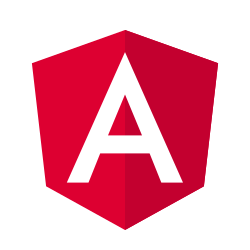

<h1 align="center">
  
</h1>

<h1 align="center">Hey!!</h1>

<table style="border: none;">
  <tr style="border: none;">
    <td style="border: none;">
      <ul>
        <li>
          🦔 Hi, I'm Miguel Angel Bonilla Fernandez.
        </li>
        <li>
          🏖️ I'm 21 years old developer from Málaga - Spain. 
        </li>
        <li>
          🏫 Currently studying at CPFIP - Alan Turing.
        </li>
        <li>
          👨🏻‍💻 Most of my projects are available on [Github](https://github.com/mabf2608?tab=repositories).
        </li>
        <li>
          🎮 Since I was a child I have been very interested in learning about video game development, that's why I'm here.
        </li>
    </td>
    <td style="border: none;">
      
    </td>
  </tr>

  
  
  

<h2 align="left"> 🛠️ Technologies and Tools that I Know:</h2>

  <code></code>
  <code></code>
  <code></code>  
  <code></code>
  <code></code>
  <code></code>
  <code></code>
  <code></code>
  <code></code>
<h2 align="left"> 📖 Technologies and Tools I'm Learning:</h2>

  <code></code>
  <code></code>
  <code></code>
  <code></code>  
  <code></code>
  

      
  > 💼 LinkedIn: <a href=>Click here.</a>

  > ✉ Mail: mabf2002@gmail.com
