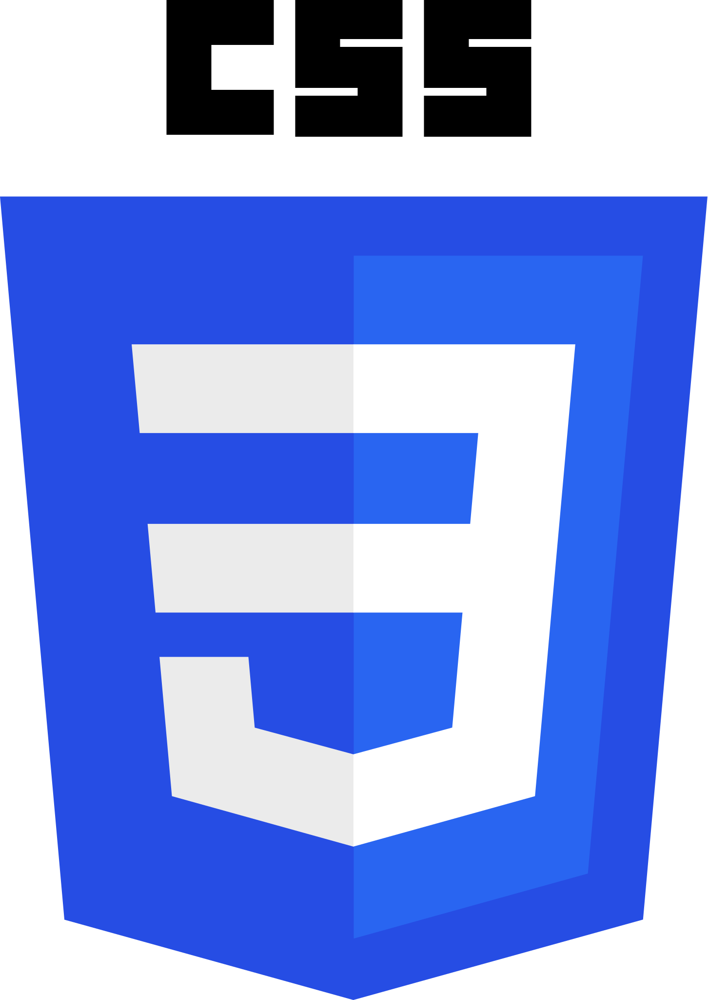
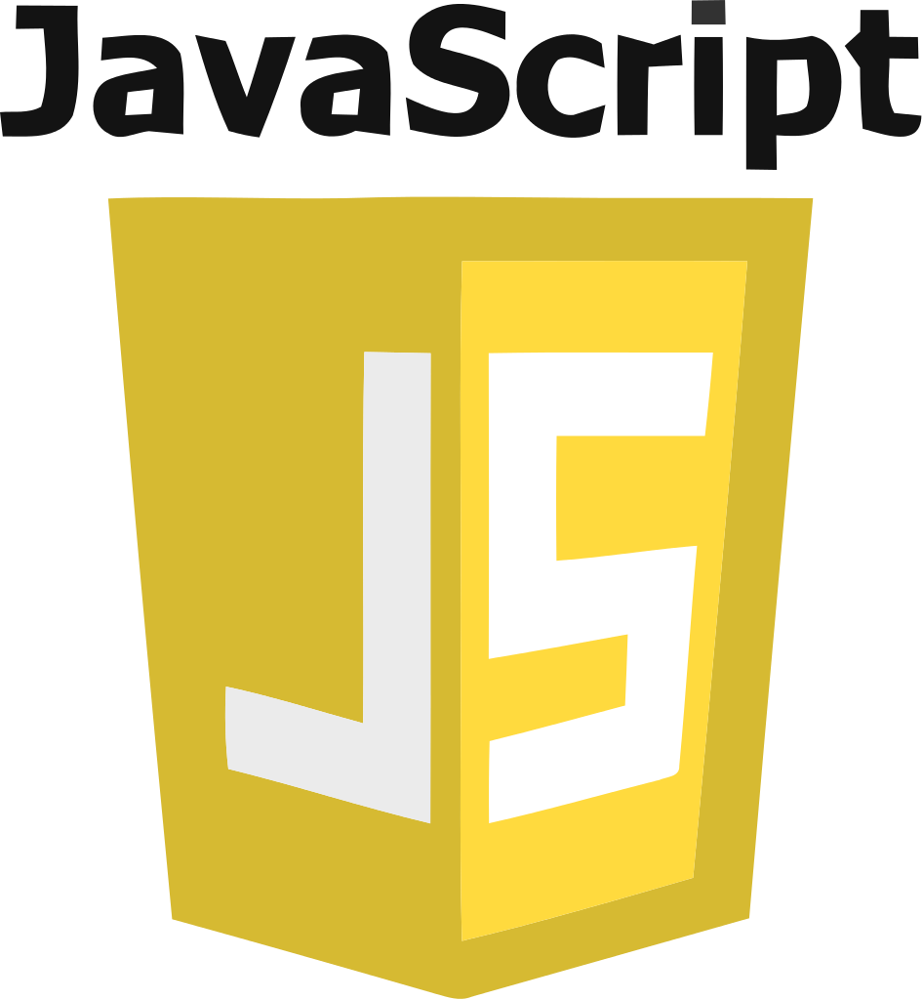
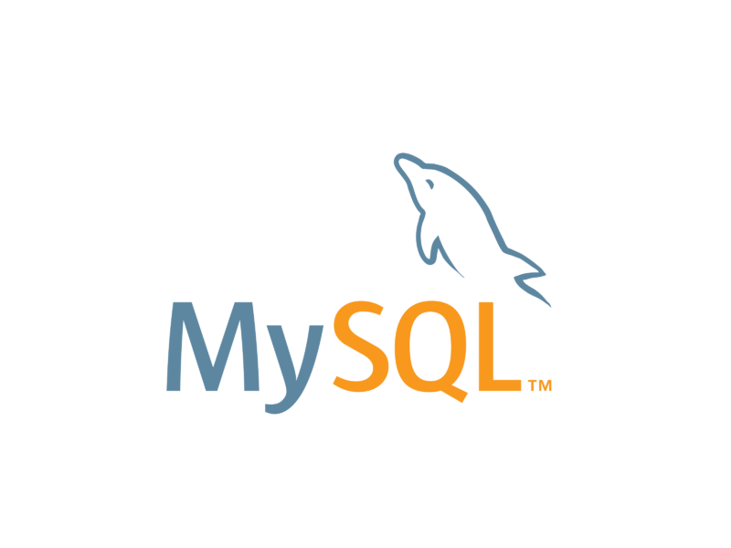
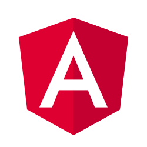
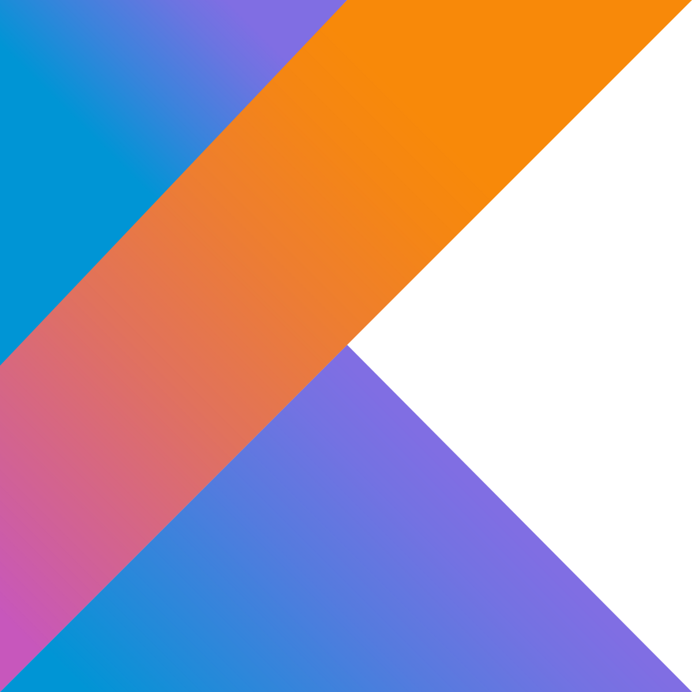

  

<h1 align="center">Hey!!</h1>

<h2 align="center"> 👾 Things About Me 👨🏼‍💻</h2>

<table style="border: none;" align="center">
  <tr style="border: none;">
    <td style="border: none;" width="50%">
      <ul>
        <li>
          🦔 I'm Miguel Ángel Bonilla Fernández.
        </li>
        <li>
          🏖️ I'm a 24 years old developer from Málaga - Spain. 
        </li>
        <li>
          🏫 Currently studying at CPFIP - Alan Turing.
        </li>
        <li>
          👨🏻‍💻 Most of my projects are available on [Github](https://github.com/mabf2608?tab=repositories).
        </li>
        <li>
          🎮 Since childhood, I have been very interested in learning about video game development and cybersecurity, which is why I am here.
        </li>
      </ul>
    </td>
    <td style="border: none;" width="50%" align="center">
      
    </td>
  </tr>
</table>
      

  
  
  

<h2 align="center"> 🛠️ Technologies and Tools that I Know 🛠️</h2>

  <code></code>
  <code></code>
  <code></code>
  <code></code>
  <code></code>
  <code></code>
  <code></code>
  <code></code>

<h2 align="center"> 📖 Technologies and Tools I'm Learning 📖</h2>

  <code></code>
  <code></code>
  <code></code>   
  <code></code>
  <code></code> 

<h2 align="center">💻 Check Out My Repos ⬇️ </h2>
